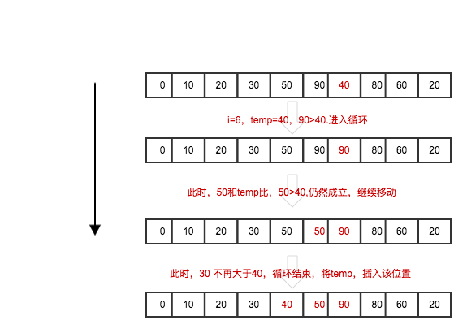

# 插入排序

    void insertSort(list *l){
        int temp,i,j;
        for(i=1;i<=l->length;i++){
            temp = l->r[i];
            //从i-1进行递减
            for(j=i-1;l->r[j] > temp;j--){ 
                //一定是 把j 移动到j+1
                 l->r[j+1] = l->r[j];  
            }
            //最后一次会进行j--,但是不符合上面的循环条件，所以j对应的值不再大于i;
            //将i插入到j后面(也就是j+1)
            if(j+1 != i){
                l->r[j+1] = temp;
            }       
        }
    }

